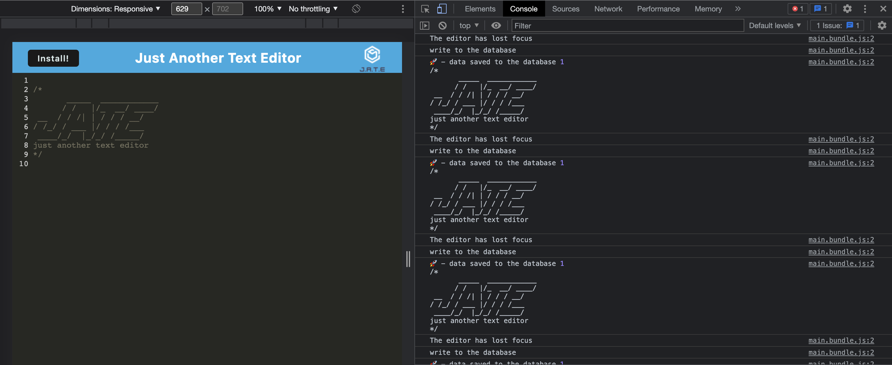

# Technicolor-text-editor

## Description
This application takes an existing text editor app and adds functionality for it to work as a PWA and function offline. This application is deployed through Heroku.

## Table of Contents
- [Description](#description)
- [Table of Contents](#table-of-contents)
- [Installation](#installation)
- [Usage](#usage)
- [Deployed Link](#deployed-link)
- [Screen Shots ](#demo)
- [Built With](#built-with)
- [Questions](#questions)

## Installation
`git clone` the repo to your local machine. To use this application, run the following command to install the dependencies: 

     npm install

Then run the following command:

`npm run start:dev`

## Usage
Type the following command in your termimal:

`npm run start`

Open the browser on the specified localhost URL to run this application on your local machine.
You can also install the program onto your desktop for offline use.

## Deployed Link

The link to the deployed application is: https://technicolor-text-editor.herokuapp.com/

## Screen Shots

**[⬆ back to top](#table-of-contents)**

## Built With

* [HTML](https://developer.mozilla.org/en-US/docs/Web/HTML)
* [CSS](https://developer.mozilla.org/en-US/docs/Web/CSS)
* [Javascript](https://developer.mozilla.org/en-US/docs/Web/Javascript)
* [NodeJS](https://nodejs.org/en/)
* [ExpressJS](https://expressjs.com/)
* [MongoDB](https://www.mongodb.com/)
  
**[⬆ back to top](#table-of-contents)**

## Questions
For any question, please contact me on GitHub: [lev8947](https://github.com/lev8947) or email me at lev_47@hotmail.com

**[⬆ back to top](#table-of-contents)**